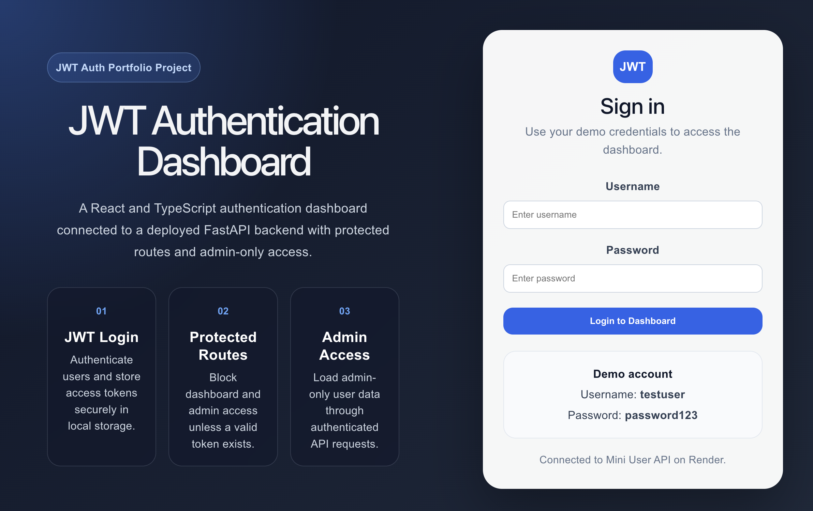
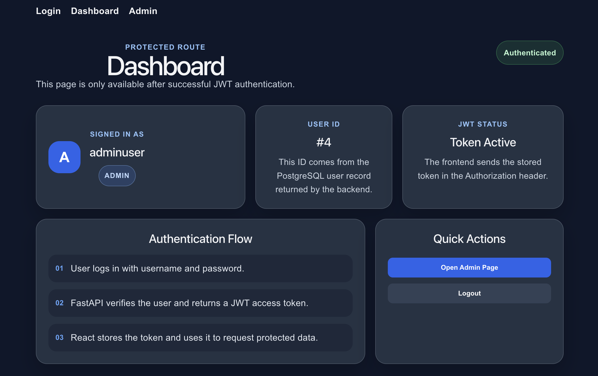
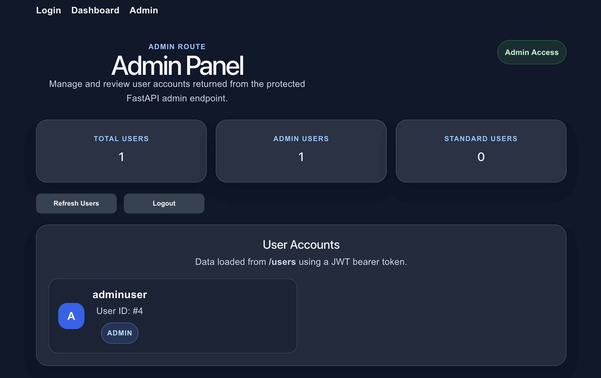

# JWT Authentication Dashboard

JWT Authentication Dashboard is a React and TypeScript authentication frontend connected to a deployed FastAPI backend.

It demonstrates a complete JWT authentication flow, including user login, token storage, protected dashboard access, admin-only user listing, role-based UI behaviour, Vercel deployment, Render backend integration, Docker support, and GitHub Actions CI checks.

## Live Demo

Frontend:

- [JWT Authentication Dashboard](https://jwt-authentication-dashboard-sepia.vercel.app)

Backend API:

- [Mini User API Swagger Docs](https://mini-user-api.onrender.com/docs)

Related backend repository:

- [Mini User API](https://github.com/Iris408/mini-user-api)

## Current Status

| Area | Status |
| --- | --- |
| React / TypeScript frontend | ✅ Complete |
| Login flow | ✅ Working |
| JWT token storage | ✅ Working |
| Protected dashboard | ✅ Working |
| Admin-only user list | ✅ Working |
| Role-based UI behaviour | ✅ Working |
| Loading and error states | ✅ Complete |
| Vercel deployment | ✅ Live |
| Render backend integration | ✅ Live |
| Frontend CI | ✅ Passing |
| Docker CI | ✅ Passing |

## Features

- User login flow
- JWT token storage
- Protected dashboard route
- Admin-only user list
- Role-based access behaviour
- Authenticated API requests
- API integration with deployed FastAPI backend
- Multi-page frontend routing
- Loading and error handling
- Responsive UI styling
- Vercel deployment
- Frontend and Docker CI workflows

## Screenshots

### Login Page



### Protected Dashboard



### Admin Panel



## Tech Stack

| Area | Technologies |
| --- | --- |
| Frontend | React, TypeScript, Vite, React Router, CSS |
| Backend API | FastAPI, PostgreSQL, SQLAlchemy, JWT authentication |
| Deployment | Vercel, Render |
| DevOps / Tooling | Docker, GitHub Actions, Git, GitHub |

## Quick Start

Clone the repository:

```bash
git clone https://github.com/Iris408/jwt-authentication-dashboard
cd jwt-authentication-dashboard
```

Install dependencies:

```bash
npm install
```

Create a `.env` file:

```env
VITE_API_URL=https://mini-user-api.onrender.com
```

Run locally:

```bash
npm run dev
```

Build check:

```bash
npm run build
```

## Documentation

More detailed project documentation is available in the `docs/` folder.

| Document | Description |
| --- | --- |
| [Setup Guide](./docs/setup.md) | Local setup, environment variables, build commands, and demo notes |
| [Auth Flow](./docs/auth-flow.md) | JWT login, token storage, protected routes, and admin-only access |
| [Frontend Notes](./docs/frontend-notes.md) | Pages, UI behaviour, routing, loading states, and frontend improvements |
| [Project Details](./docs/project-details.md) | Architecture, related backend, limitations, future improvements, and learning notes |
| [CI/CD Notes](./docs/ci-cd.md) | Frontend CI and Docker CI workflow notes |

## Project Summary

JWT Authentication Dashboard is a frontend authentication project built to practise React and TypeScript authentication flows, protected routing, role-based UI behaviour, authenticated API requests, deployed backend integration, Vercel deployment, Docker support, and CI/CD checks.

## Author

Built by Iris408