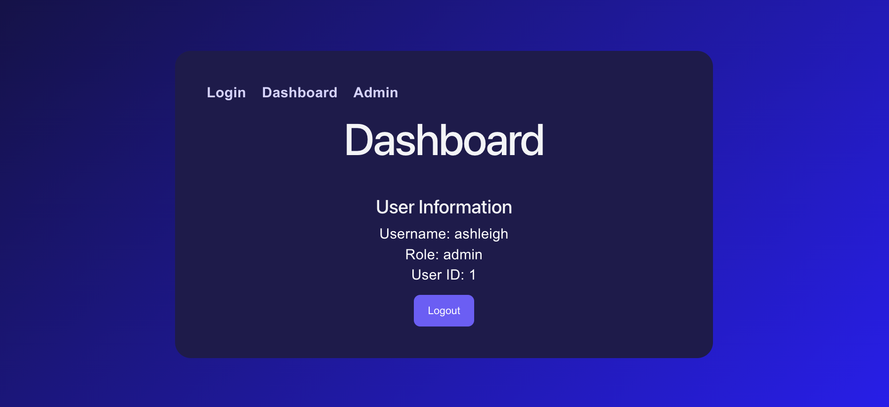

# JWT Authentication Dashboard / JWT認証ダッシュボード

JWT Authentication Dashboard is a React + TypeScript frontend application connected to a deployed FastAPI backend.

It supports user login, JWT token storage, protected dashboard access, admin-only user listing, role-based UI flows, Vercel frontend deployment, Render backend integration, and GitHub Actions CI checks.

JWT認証ダッシュボードは、デプロイ済みのFastAPIバックエンドに接続されたReact + TypeScriptフロントエンドアプリケーションです。

ユーザーログイン、JWTトークンの保存、保護されたダッシュボードアクセス、管理者専用ユーザー一覧、ロールベースのUIフロー、Vercelフロントエンドデプロイ、Renderバックエンド連携、GitHub Actions CIチェックをサポートしています。

## Current Status

This frontend authentication dashboard is connected to the deployed Mini User API backend.

### Completed
- Login form working
- JWT token received from backend
- Dashboard displays authenticated user details
- Admin page available for admin users
- Protected route behaviour added
- Frontend connected to deployed Render backend

## Live Demo  / ライブデモ

**Frontend deployed on Vercel:**
[JWT Authentication Dashboard](https://jwt-authentication-dashboard-sepia.vercel.app)
---
**Backend API deployed on Render:**
[Mini User API Swagger Docs](https://mini-user-api.onrender.com/docs)
---
**Backend Repo:**
[Mini User API Repo](https://github.com/Iris408/mini-user-api)

### Next Improvements
- Improve invalid login error messages
- Add loading states
- Add clearer unauthorized page
- Add frontend test setup later

## Portfolio Ready v1/ポートフォリオ準備完了 v1

| Area | Status |
| --- | --- |
| Frontend UI | ✅ Complete |
| Login flow | ✅ Working |
| JWT token storage | ✅ Working |
| Protected dashboard | ✅ Working |
| Admin-only user list | ✅ Working |
| Vercel frontend deployment | ✅ Live |
| Render backend link | ✅ Live |
| GitHub Actions CI | ✅ Passing |

This project is portfolio-ready as a deployed React + TypeScript authentication dashboard connected to a deployed FastAPI backend with protected routes, admin access, role-based user management, and CI checks.

このプロジェクトは、保護されたルート、管理者アクセス権、ロールベースのユーザー管理、CIチェックを備えた、デプロイ済みのFastAPIバックエンドに接続されたReact + TypeScriptによる認証ダッシュボードとして、ポートフォリオにそのまま掲載できる状態になっています。

## Screenshots




## Features / 機能 

| English | 日本語 |
|---|---|
| User login flow | ユーザーログインフロー |
| JWT token storage | JWTトークンの保存 |
| Protected dashboard route | 保護されたダッシュボードルート |
| Admin-only user list | 管理者専用ユーザー一覧 |
| Role-based access control | ロールベースアクセス制御 |
| API integration with deployed backend | デプロイ済みバックエンドとのAPI統合 |
| Multi-page frontend routing | マルチページフロントエンドルーティング |
| Responsive UI styling | レスポンシブUIスタイリング |
| GitHub Actions CI workflow | GitHub Actions CI ワークフロー |


## Tech Stack / 技術スタック

| Area / 分野 | Technologies / 技術 |
|---|---|
| Frontend/ フロントエンド | React, TypeScript, CSS, Vite, React Router |
| Backend/ バックエンドAPI | FastAPI, PostgreSQL, SQLAlchemy, JWT Authentication |
| Deployment/ デプロイ | Vercel, Render |
| CI/CD | GitHub Actions |
| Tools/ ツール | Git, GitHub, VS Code |

## Local Installation / ローカルインストール
Clone the repository:
```bash
git clone https://github.com/Iris408/jwt-authentication-dashboard
cd jwt-authentication-dashboard
npm install
```
Create a `.env` file in the project root:
```bash
VITE_API_URL=https://mini-user-api.onrender.com
```

Start the server:
```bash
npm run dev
```

## Auth Flow

1. User enters login details.
2. The frontend sends the login request to the Mini User API backend.
3. The backend returns a JWT access token.
4. The frontend stores the token.
5. Protected pages use the token to request user/admin data.
6. Admin-only views are restricted based on the user's role.

## Pages

| Page | Route | Description |
|---|---|---|
| Login | `/` | User login page |
| Dashboard | `/dashboard` | Protected user profile page |
| Admin | `/admin` | Admin-only user list |

## API Endpoints | APIエンドポイント

| Method | Endpoint | Description |
|---|---|---|
| GET | `/` | Home / health check |
| POST | `/users` | Create a new user |
| POST | `/login` | Login user with JSON request |
| POST | `/token` | OAuth2 token login for Swagger authorization |
| GET | `/profile` | Get protected user profile |
| GET | `/users` | Get all users — admin only |
| GET | `/users/{user_id}` | Get one user by ID |
| PUT | `/users/{user_id}` | Update a user |
| DELETE | `/users/{user_id}` | Delete a user |

# Future Improvements/ 今後の改善

| English | 日本語 |
|---|---|
| CI/CD deployment improvements | CI/CDデプロイ改善 |
| Refresh token support | リフレッシュトークン対応 |
| Improved mobile styling | モバイル表示の改善 |
| User profile editing | ユーザープロフィール編集 |
| Admin role editing | 管理者ロールの編集 |
| Loading states and error messages | 読み込み状態とエラーメッセージ |
| Dark/light mode support | ダーク・ライトモード対応 |
| Frontend tests | フロントエンドテスト |