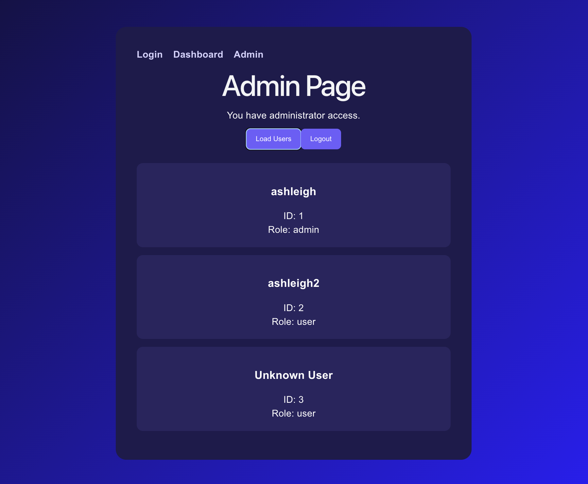

# Mini User API Frontend
# ミニユーザーAPIフロントエンド / 미니 사용자 API 프론트엔드

A full-stack authentication dashboard built with React, TypeScript, FastAPI, PostgreSQL, and JWT authentication.

認証を使用して構築したフルスタック認証ダッシュボードです。
인증을 사용하여 구축한 풀스택 인증 대시보드입니다.

---

# Features / 機能 / 주요 기능

| English | 日本語 | 한국어 |
|---|---|---|
| JWT Authentication | JWT認証 | JWT 인증 |
| Protected Routes | 保護ルート | 보호 라우트 |
| Admin Dashboard | 管理者ダッシュボード | 관리자 대시보드 |
| User Management | ユーザー管理 | 사용자 관리 |
| API Integration | API統合 | API 통합 |
| React State Management | React状態管理 | React 상태 관리 |
| Multi-Page Frontend | マルチページ構成 | 멀티 페이지 구조 |
| Responsive UI Styling | レスポンシブUI | 반응형 UI |

---

# Tech Stack / 技術スタック/ 기술 스택

## Frontend
- React
- TypeScript
- CSS
- Vite

## Backend
- FastAPI
- Python
- PostgreSQL
- SQLAlchemy

## Tools
- Git
- GitHub
- VS Code

---

## Screenshots

  
  
  

---

# Authentication Flow / 認証フロー / 인증 흐름

1. Login request sent  
   ログイン要求送信 / 로그인 요청 전송

2. Backend validates credentials  
   認証情報確認 / 사용자 인증 확인

3. JWT token generated  
   JWT生成 / JWT 생성

4. Token stored in localStorage  
   localStorage保存 / localStorage 저장

5. Protected dashboard unlocked  
   保護ページアクセス / 보호된 페이지 접근

---

# Future Improvements/ 今後の改善/ 향후 개선 사항

| English | 日本語 | 한국어 |
|---|---|---|
| Docker containerisation | Dockerコンテナ化 | Docker 컨테이너화 |
| Cloud deployment | クラウドデプロイ | 클라우드 배포 |
| Refresh token support | リフレッシュトークン対応 | 리프레시 토큰 지원 |
| Improved responsive design | レスポンシブデザイン改善 | 반응형 디자인 개선 |
| User profile editing | ユーザープロフィール編集 | 사용자 프로필 수정 |
| Dark/light mode support | ダーク・ライトモード対応 | 다크/라이트 모드 지원 |

---

# Learning Outcomes/ 学習内容/ 학습 내용

| English | 日本語 | 한국어 |
|---|---|---|
| Frontend/backend integration | フロントエンド・バックエンド統合 | 프론트엔드/백엔드 통합 |
| JWT authentication | JWT認証 | JWT 인증 |
| REST API communication | REST API通信 | REST API 통신 |
| React state management | React状態管理 | React 상태 관리 |
| Protected routes | 保護ルート | 보호 라우트 |
| Async API requests | 非同期APIリクエスト | 비동기 API 요청 |
| Full-stack architecture | フルスタック構造 | 풀스택 구조 |
